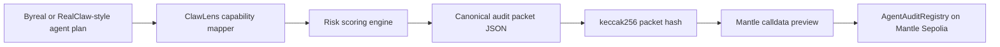

# ClawLens Mantle DevTool

ClawLens is an AI DevTools audit console for Byreal and RealClaw-style DeFi agents. It turns an agent action plan into a deterministic audit packet, scores execution risk, previews the Mantle registry calldata, and can anchor the packet hash to a Mantle Sepolia smart contract.

Hackathon target: The Turing Test Hackathon 2026, AI DevTools track.

Live demo: https://cecon123.github.io/clawlens-mantle-devtool/

Repository: https://github.com/cecon123/clawlens-mantle-devtool

## Why It Exists

Autonomous DeFi agents can quote, route, copy-farm, or rebalance faster than a user can review every step. ClawLens adds a pre-execution review layer:

- maps an agent plan to a Byreal-style capability such as Pool Analysis, Copy Farming, or Swap Execution
- scores token exposure, slippage, confirmation policy, autonomy depth, and signal coverage
- creates a canonical JSON packet and keccak256 packet hash
- prepares the exact `recordAudit(bytes32,string,uint8,string)` payload for Mantle
- records the packet hash on-chain after a Mantle Sepolia wallet is funded

This is intentionally not another trading bot. It is a judge-verifiable transparency tool for AI agents.

## Current Status

- Frontend dashboard: complete
- Public frontend: live on GitHub Pages
- Deterministic audit packet engine: complete
- Sample packet: complete
- Solidity registry contract: complete
- Build and unit tests: passing
- Mantle Sepolia deployment: pending until the generated deploy wallet receives testnet MNT

Generated deploy wallet:

```text
0xA627b3340398138694d5c857AC813bf7Ee30E365
```

The private key is stored only in `.local/wallet.json`, which is gitignored.

## Tech Stack

- Vite
- React
- TypeScript
- ethers v6
- Solidity 0.8.24
- solc-js
- Vitest

## Architecture



## Run Locally

```bash
npm install
npm run packets:write
npm run contract:compile
npm test
npm run build
npm run dev
```

## Mantle Sepolia Deployment

Create or reuse the local deploy wallet:

```bash
npm run wallet:new
npm run wallet:balance
```

Fund the wallet with Mantle Sepolia MNT, then deploy:

```bash
npm run contract:deploy
npm run contract:record
```

After a successful deployment, the scripts write:

- `deployments/mantle-sepolia.json`
- `deployments/demo-record.json`
- `src/lib/deployment.ts`

## Contract

`contracts/AgentAuditRegistry.sol` stores:

- packet hash
- agent label
- risk score
- packet URI
- reporter address
- timestamp

The contract emits `AuditRecorded` for each packet so judges can compare the UI packet, JSON artifact, and explorer transaction.

## Sample Packet

The main sample is:

```text
sample-packets/copy-farm-guardrail.json
```

Packet hash:

```text
0x4d46fe14eb44e6e82388fae4cf4804ab86d80ed74042a210cba9c91bf7b88ded
```

## Hackathon Fit

ClawLens aligns with the AI DevTools track because it gives Mantle AI-agent builders a reusable guardrail layer:

- pre-execution risk review
- deterministic audit evidence
- on-chain proof anchoring
- clearer UX for reviewing autonomous finance actions

It references Byreal Agent Skills capabilities without pretending to execute live swaps or manage real user funds.

## Honest Limitations

- The sample plans are deterministic demo plans, not live Byreal API imports.
- RealClaw live execution is not used because it currently requires invite-only beta access and live funds.
- Mantle deployment requires testnet MNT. The app should not be submitted as deployed until the deployment scripts produce a real explorer address.

## Visual Asset

`src/assets/clawlens-hero.png` was generated for this project as a custom product visual.

## License

MIT
